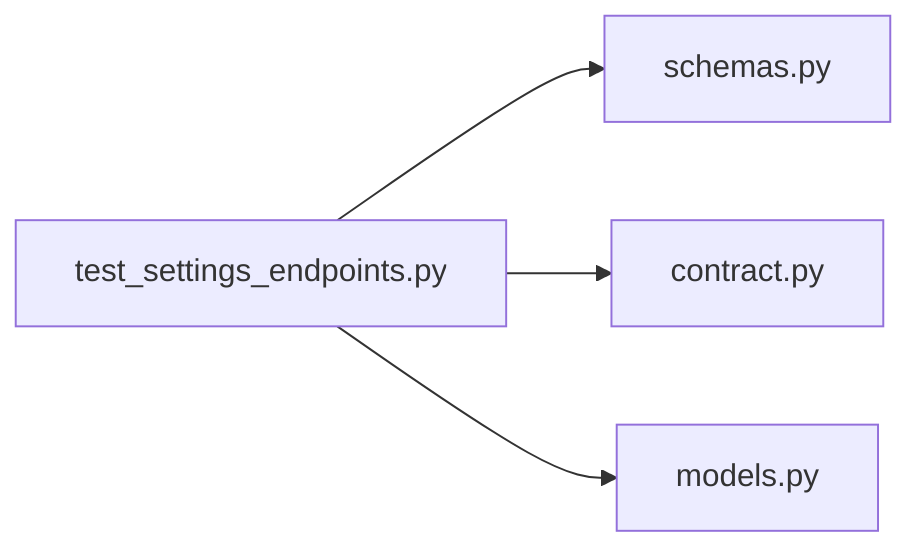

# test_settings_endpoints.py

저장소 경로 `backend/tests/integration/db/test_settings_endpoints.py` 의 관계 노트입니다. `scripts/codegraph.py` 가 생성하므로 직접 수정하지 않습니다.

## imports

- [[graph/backend/src/backend/api/schemas|schemas.py]]
- [[graph/backend/src/backend/contract|contract.py]]
- [[graph/backend/src/backend/db/models|models.py]]

## imported by

- 없음

## 함수와 호출

- `test_the_slot_size_starts_at_one_hour`
- `test_the_first_account_can_change_the_slot_size`
- `test_a_slot_size_that_does_not_divide_an_hour_is_refused`
- `test_a_member_without_room_edit_cannot_change_the_slot_size`
- `test_the_new_slot_size_decides_which_reservation_times_are_allowed`
- `test_the_database_rejects_a_slot_unit_the_api_rejects`
- `test_the_database_accepts_every_slot_unit_the_api_accepts`
- `test_the_session_length_starts_at_one_hour`
- `test_the_session_length_can_be_changed_on_its_own`
- `test_a_session_shorter_than_one_slot_is_refused`
- `test_a_session_that_is_not_a_whole_number_of_slots_is_refused`
- `test_both_values_change_together_when_sent_together`
- `test_a_slot_size_that_would_break_the_saved_session_length_is_refused`
- `test_a_patch_with_no_value_is_refused`
- `test_the_database_rejects_a_session_length_that_is_not_a_whole_number_of_slots`
- `test_the_daily_limit_per_team_starts_at_three_hours_and_takes_one_to_three`
- `test_the_daily_limit_cannot_be_shorter_than_one_session`
- `test_the_api_daily_limit_choices_match_the_contract`
