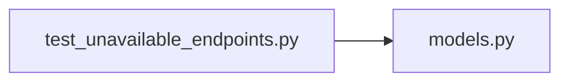

# test_unavailable_endpoints.py

저장소 경로 `backend/tests/integration/db/test_unavailable_endpoints.py` 의 관계 노트입니다. `scripts/codegraph.py` 가 생성하므로 직접 수정하지 않습니다.

## imports

- [[graph/backend/src/backend/db/models|models.py]]

## imported by

- 없음

## 함수와 호출

- `_unavailable`: `backend.db.models`
- `test_unavailable_endpoints_require_login`
- `test_unavailable_endpoints_reject_another_members_times`
- `test_unavailable_times_are_listed_for_a_member_in_time_order`
- `test_unavailable_time_is_created_with_on_the_hour_bounds`
- `test_unavailable_time_keeps_the_name_it_was_given`
- `test_unavailable_time_keeps_the_reason_it_was_given`
- `test_unavailable_time_with_a_blank_reason_stores_nothing`
- `test_unavailable_time_creation_rejects_a_count_and_an_end_date_together`
- `test_unavailable_time_creation_rejects_off_grid_minutes`
- `test_unavailable_time_creation_rejects_an_end_not_after_the_start`
- `test_unavailable_time_creation_rejects_a_repeat_until_when_not_weekly`
- `test_unavailable_time_creation_of_an_unknown_member_is_rejected`
- `test_unavailable_time_is_deleted`
- `test_unavailable_time_deletion_rejects_another_members_time`
- `test_unavailable_time_can_be_edited`
- `test_editing_someone_elses_unavailable_time_is_refused`
- `test_all_members_unavailable_requires_login`
- `test_all_members_unavailable_rejects_a_member_without_the_permission`
- `test_all_members_unavailable_lists_every_member_in_time_order`
- `test_the_permission_opens_another_members_unavailable_list`
- `test_the_permission_does_not_open_changing_another_members_times`
