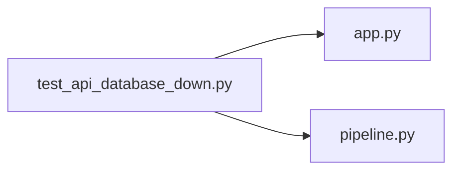

# test_api_database_down.py

저장소 경로 `backend/tests/unit/test_api_database_down.py` 의 관계 노트입니다. `scripts/codegraph.py` 가 생성하므로 직접 수정하지 않습니다.

## imports

- [[graph/backend/src/backend/api/app|app.py]]
- [[graph/backend/src/backend/db/pipeline|pipeline.py]]

## imported by

- 없음

## 함수와 호출

- `_refuse_session`
- `test_database_down_answers_503_not_500`
- `test_database_down_is_written_to_the_log`
- `test_database_down_does_not_leak_internals_to_the_user`
