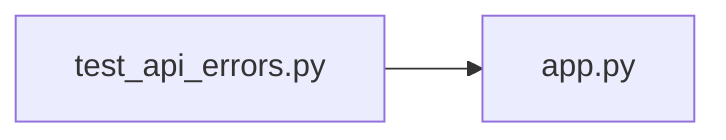

# test_api_errors.py

저장소 경로 `backend/tests/unit/test_api_errors.py` 의 관계 노트입니다. `scripts/codegraph.py` 가 생성하므로 직접 수정하지 않습니다.

## imports

- [[graph/backend/src/backend/api/app|app.py]]

## imported by

- 없음

## 함수와 호출

- `_with_route`: `backend.api.app.get`
- `test_value_error_becomes_422_with_the_message`
- `test_permission_error_becomes_403_with_the_message`
