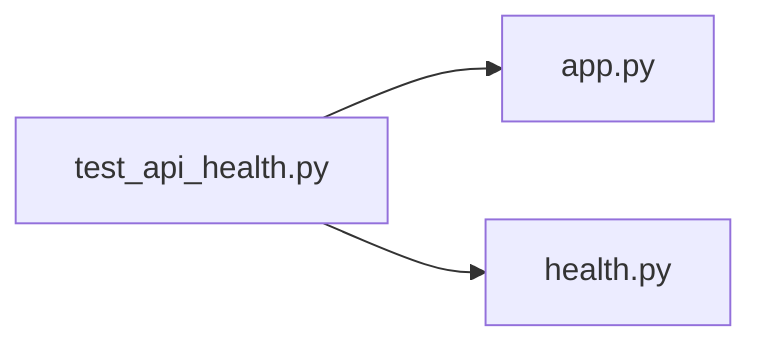

# test_api_health.py

저장소 경로 `backend/tests/unit/test_api_health.py` 의 관계 노트입니다. `scripts/codegraph.py` 가 생성하므로 직접 수정하지 않습니다.

## imports

- [[graph/backend/src/backend/api/app|app.py]]
- [[graph/backend/src/backend/db/health|health.py]]

## imported by

- 없음

## 함수와 호출

- `test_health_reports_each_dependency_when_everything_is_up`: `backend.db.health`
- `test_health_reports_which_dependency_failed`: `backend.db.health`
