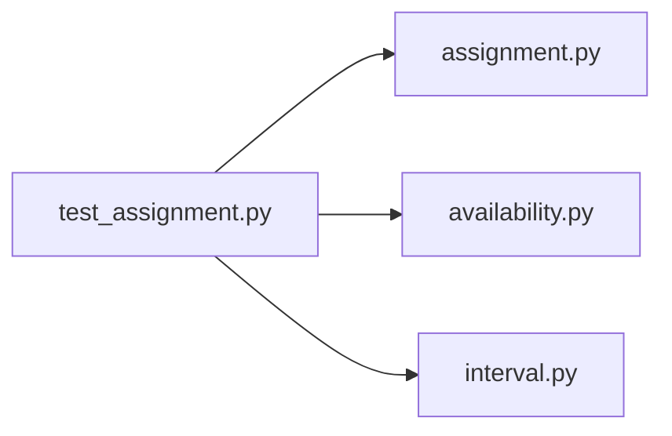

# test_assignment.py

저장소 경로 `backend/tests/unit/test_assignment.py` 의 관계 노트입니다. `scripts/codegraph.py` 가 생성하므로 직접 수정하지 않습니다.

## imports

- [[graph/backend/src/backend/scheduling/assignment|assignment.py]]
- [[graph/backend/src/backend/scheduling/availability|availability.py]]
- [[graph/backend/src/backend/scheduling/interval|interval.py]]

## imported by

- 없음

## 함수와 호출

- `_at`
- `test_team_is_assigned_only_to_a_slot_it_is_available_for`: `backend.scheduling.assignment`, `backend.scheduling.availability`, `backend.scheduling.interval`
- `test_team_gets_exactly_the_requested_number_of_slots`: `backend.scheduling.assignment`, `backend.scheduling.availability`, `backend.scheduling.interval`
- `test_session_occupies_one_uninterrupted_interval`: `backend.scheduling.assignment`, `backend.scheduling.availability`, `backend.scheduling.interval`
- `test_two_sessions_of_the_same_team_do_not_overlap`: `backend.scheduling.assignment`, `backend.scheduling.availability`, `backend.scheduling.interval`
- `test_two_teams_do_not_share_a_slot_that_a_session_covers`: `backend.scheduling.assignment`, `backend.scheduling.availability`, `backend.scheduling.interval`
- `test_open_slots_exclude_every_slot_a_session_covers`: `backend.scheduling.assignment`, `backend.scheduling.availability`, `backend.scheduling.interval`
- `_is_one_run`
- `test_sessions_of_a_team_are_placed_back_to_back`: `backend.scheduling.assignment`, `backend.scheduling.availability`, `backend.scheduling.interval`
- `test_sessions_skip_only_the_unavailable_hour`: `backend.scheduling.assignment`, `backend.scheduling.availability`, `backend.scheduling.interval`
- `test_assignment_stops_improving_shortly_after_the_first_solution`: `backend.scheduling.assignment`, `backend.scheduling.availability`, `backend.scheduling.interval`
- `test_a_team_gets_no_more_than_the_daily_limit_on_one_day`: `backend.scheduling.assignment`, `backend.scheduling.availability`, `backend.scheduling.interval`
