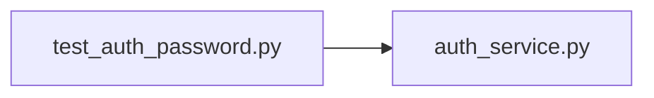

# test_auth_password.py

저장소 경로 `backend/tests/unit/test_auth_password.py` 의 관계 노트입니다. `scripts/codegraph.py` 가 생성하므로 직접 수정하지 않습니다.

## imports

- [[graph/backend/src/backend/services/auth/auth_service|auth_service.py]]

## imported by

- 없음

## 함수와 호출

- `test_hash_password_returns_the_labeled_new_format`: `backend.services.auth.auth_service`
- `test_verify_password_accepts_the_correct_password`: `backend.services.auth.auth_service`
- `test_verify_password_rejects_the_wrong_password`: `backend.services.auth.auth_service`
- `test_hash_password_salts_each_call_differently`: `backend.services.auth.auth_service`
