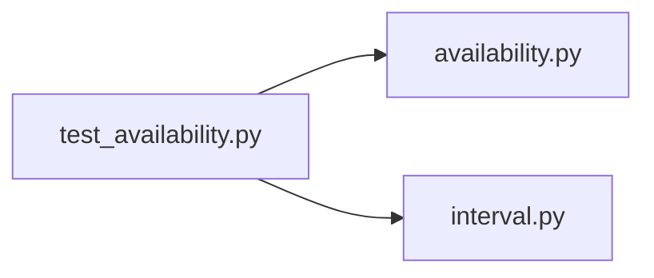

# test_availability.py

저장소 경로 `backend/tests/unit/test_availability.py` 의 관계 노트입니다. `scripts/codegraph.py` 가 생성하므로 직접 수정하지 않습니다.

## imports

- [[graph/backend/src/backend/scheduling/availability|availability.py]]
- [[graph/backend/src/backend/scheduling/interval|interval.py]]

## imported by

- 없음

## 함수와 호출

- `test_member_unavailable_when_slot_overlaps_their_unavailable_time`: `backend.scheduling.availability`, `backend.scheduling.interval`
- `test_member_available_when_slot_is_outside_their_unavailable_time`: `backend.scheduling.availability`, `backend.scheduling.interval`
- `test_member_available_when_slot_is_adjacent_to_unavailable_time`: `backend.scheduling.availability`, `backend.scheduling.interval`
