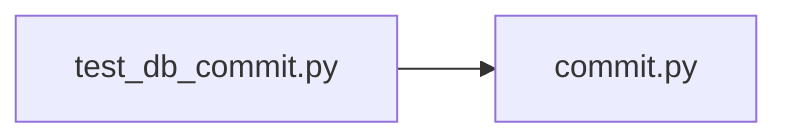

# test_db_commit.py

저장소 경로 `backend/tests/unit/test_db_commit.py` 의 관계 노트입니다. `scripts/codegraph.py` 가 생성하므로 직접 수정하지 않습니다.

## imports

- [[graph/backend/src/backend/db/commit|commit.py]]

## imported by

- 없음

## 함수와 호출

- `_violation`
- `test_a_known_constraint_becomes_the_given_message`: `backend.db.commit`
- `test_an_unknown_constraint_is_raised_as_is`: `backend.db.commit`
- `test_a_clean_commit_just_commits`: `backend.db.commit`
- `test_the_error_type_can_be_narrowed`: `backend.db.commit`
- `test_an_action_other_than_commit_is_translated_too`: `backend.db.commit`
- `test_an_error_that_is_not_a_violation_rolls_back_and_propagates`: `backend.db.commit`
