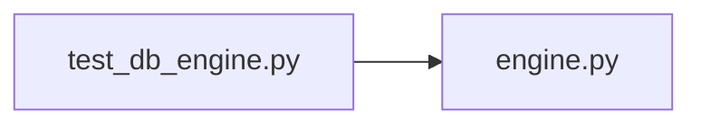

# test_db_engine.py

저장소 경로 `backend/tests/unit/test_db_engine.py` 의 관계 노트입니다. `scripts/codegraph.py` 가 생성하므로 직접 수정하지 않습니다.

## imports

- [[graph/backend/src/backend/db/engine|engine.py]]

## imported by

- 없음

## 함수와 호출

- `test_create_db_engine_applies_connect_and_pool_timeouts`: `backend.db.engine`
- `test_create_db_engine_falls_back_to_default_timeouts`: `backend.db.engine`
- `test_create_db_engine_rejects_useless_timeout_values`: `backend.db.engine`
