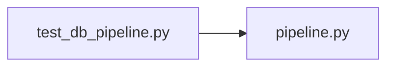

# test_db_pipeline.py

저장소 경로 `backend/tests/unit/test_db_pipeline.py` 의 관계 노트입니다. `scripts/codegraph.py` 가 생성하므로 직접 수정하지 않습니다.

## imports

- [[graph/backend/src/backend/db/pipeline|pipeline.py]]

## imported by

- 없음

## 함수와 호출

- `test_get_engine_reuses_the_same_engine_for_the_same_url`: `backend.db.pipeline`
- `test_get_engine_fails_immediately_without_database_url`: `backend.db.pipeline`
- `test_get_session_closes_the_session_when_the_request_ends`: `backend.db.pipeline`
- `test_session_factory_opens_a_new_session_each_call`: `backend.db.pipeline`
