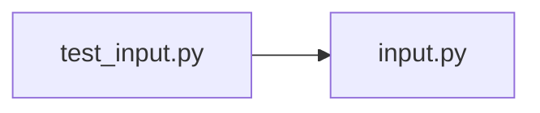

# test_input.py

저장소 경로 `backend/tests/unit/test_input.py` 의 관계 노트입니다. `scripts/codegraph.py` 가 생성하므로 직접 수정하지 않습니다.

## imports

- [[graph/backend/src/backend/services/validation/input|input.py]]

## imported by

- 없음

## 함수와 호출

- `require_valid_slot_bounds_60`: `backend.services.validation.input`
- `test_require_non_empty_trims_surrounding_whitespace`: `backend.services.validation.input`
- `test_require_non_empty_rejects_an_empty_string`: `backend.services.validation.input`
- `test_require_non_empty_rejects_a_whitespace_only_string`: `backend.services.validation.input`
- `test_format_created_at_writes_seconds_without_microseconds`: `backend.services.validation.input`
- `test_require_name_trims_surrounding_whitespace`: `backend.services.validation.input`
- `test_require_name_rejects_an_empty_string`: `backend.services.validation.input`
- `test_require_email_accepts_a_well_formed_address`: `backend.services.validation.input`
- `test_require_email_rejects_malformed_addresses`: `backend.services.validation.input`
- `test_require_password_accepts_all_four_kinds_of_character`: `backend.services.validation.input`
- `test_require_password_rejects_characters_outside_ascii`: `backend.services.validation.input`
- `test_require_email_rejects_characters_outside_ascii`: `backend.services.validation.input`
- `test_require_password_rejects_a_password_missing_any_rule`: `backend.services.validation.input`
- `test_require_login_id_rejects_anything_but_lowercase_letters_and_digits`: `backend.services.validation.input`
- `test_require_login_id_accepts_lowercase_letters_and_digits`: `backend.services.validation.input`
- `test_require_password_rejects_symbols_outside_the_list`: `backend.services.validation.input`
- `test_require_password_accepts_every_symbol_on_the_list`: `backend.services.validation.input`
- `test_require_department_rejects_digits_and_symbols`: `backend.services.validation.input`
- `test_require_department_accepts_letters_and_spaces`: `backend.services.validation.input`
- `test_require_person_name_rejects_digits_and_symbols`: `backend.services.validation.input`
- `test_require_person_name_accepts_letters_and_spaces`: `backend.services.validation.input`
- `test_parse_clock_reads_a_room_time`: `backend.services.validation.input`
- `test_parse_clock_rejects_a_bad_room_time`: `backend.services.validation.input`
- `test_format_clock_writes_a_room_time`: `backend.services.validation.input`
- `test_on_the_hour_accepts_on_grid_minutes`: `backend.services.validation.input`
- `test_on_the_hour_rejects_off_grid_minute`: `backend.services.validation.input`
- `test_closes_after_opens_rejects_equal_times`: `backend.services.validation.input`
- `test_closes_after_opens_rejects_earlier_close`: `backend.services.validation.input`
- `test_closes_after_opens_accepts_a_later_close`: `backend.services.validation.input`
- `test_require_room_name_trims_surrounding_whitespace`: `backend.services.validation.input`
- `test_require_room_name_rejects_an_empty_string`: `backend.services.validation.input`
- `test_require_room_name_rejects_a_whitespace_only_string`: `backend.services.validation.input`
- `test_parse_clock_reads_a_run_time`: `backend.services.validation.input`
- `test_parse_clock_rejects_a_bad_run_time`: `backend.services.validation.input`
- `test_parse_clock_does_not_require_a_on_the_hour`: `backend.services.validation.input`
- `test_format_clock_writes_a_run_time`: `backend.services.validation.input`
- `test_parse_calendar_date_reads_iso_date`: `backend.services.validation.input`
- `test_parse_calendar_date_rejects_bad_format`: `backend.services.validation.input`
- `test_format_calendar_date_writes_iso`: `backend.services.validation.input`
- `test_valid_kind_accepts_open_and_focused`: `backend.services.validation.input`
- `test_valid_kind_rejects_anything_else`: `backend.services.validation.input`
- `test_ends_on_before_starts_on_is_rejected`: `backend.services.validation.input`
- `test_ends_on_equal_to_starts_on_is_accepted`: `backend.services.validation.input`
- `test_accepts_a_same_day_interval`: `backend.services.validation.input`
- `test_rejects_an_interval_crossing_midnight`: `backend.services.validation.input`
- `test_accepts_an_interval_within_room_hours`: `backend.services.validation.input`
- `test_rejects_starting_before_the_room_opens`: `backend.services.validation.input`
- `test_rejects_ending_after_the_room_closes`: `backend.services.validation.input`
- `test_accepts_a_valid_on_the_hour_aligned_interval`
- `test_rejects_off_grid_minutes`
- `test_rejects_an_end_not_after_the_start`
- `test_rejects_timezone_aware_moments`
- `test_allows_a_repeat_end_date_when_repeating`: `backend.services.validation.input`
- `test_allows_a_repeat_count_when_repeating`: `backend.services.validation.input`
- `test_allows_repeating_without_an_end`: `backend.services.validation.input`
- `test_allows_no_end_when_not_repeating`: `backend.services.validation.input`
- `test_rejects_a_repeat_end_when_not_repeating`: `backend.services.validation.input`
- `test_rejects_a_count_and_an_end_date_together`: `backend.services.validation.input`
- `test_rejects_a_repeat_count_below_one`: `backend.services.validation.input`
- `test_allows_every_weekday_and_rejects_values_outside_the_range`: `backend.services.validation.input`
- `test_require_team_name_rejects_an_empty_string`: `backend.services.validation.input`
- `test_require_team_name_rejects_a_whitespace_only_string`: `backend.services.validation.input`
