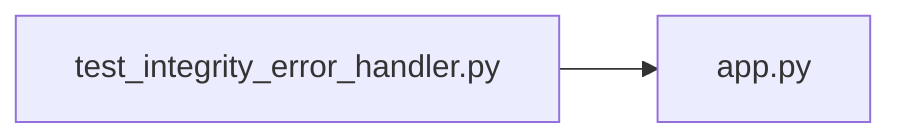

# test_integrity_error_handler.py

저장소 경로 `backend/tests/unit/test_integrity_error_handler.py` 의 관계 노트입니다. `scripts/codegraph.py` 가 생성하므로 직접 수정하지 않습니다.

## imports

- [[graph/backend/src/backend/api/app|app.py]]

## imported by

- 없음

## 함수와 호출

- `_request`
- `test_handle_integrity_error_returns_409_with_a_generic_message`: `backend.api.app`
