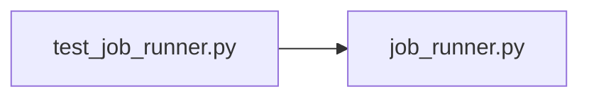

# test_job_runner.py

저장소 경로 `backend/tests/unit/test_job_runner.py` 의 관계 노트입니다. `scripts/codegraph.py` 가 생성하므로 직접 수정하지 않습니다.

## imports

- [[graph/backend/src/backend/api/job_runner|job_runner.py]]

## imported by

- 없음

## 함수와 호출

- `_wait_until`
- `_status`
- `test_submit_returns_a_queued_job_immediately`: `backend.api.job_runner`
- `test_job_moves_from_running_to_done_with_the_result`: `backend.api.job_runner`
- `test_a_job_never_reads_as_done_without_a_finish_time`: `backend.api.job_runner`
- `test_a_failing_job_becomes_failed_with_a_readable_message`: `backend.api.job_runner`
- `test_an_unexpected_error_does_not_leak_internal_detail`: `backend.api.job_runner`
- `test_unknown_job_id_returns_none`: `backend.api.job_runner`
- `test_extra_jobs_stay_queued_until_a_worker_frees_up`: `backend.api.job_runner`
- `test_max_concurrent_jobs_from_env_reads_a_positive_integer`: `backend.api.job_runner`
- `test_max_concurrent_jobs_from_env_falls_back_to_default`: `backend.api.job_runner`
- `test_max_concurrent_jobs_from_env_falls_back_when_unset`: `backend.api.job_runner`
