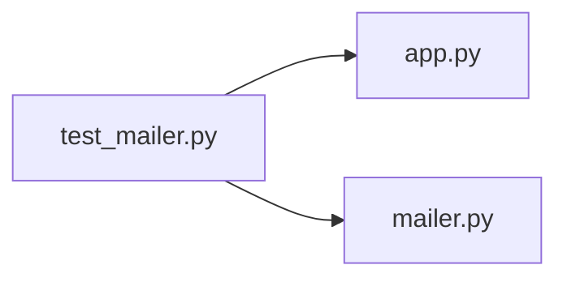

# test_mailer.py

저장소 경로 `backend/tests/unit/test_mailer.py` 의 관계 노트입니다. `scripts/codegraph.py` 가 생성하므로 직접 수정하지 않습니다.

## imports

- [[graph/backend/src/backend/api/app|app.py]]
- [[graph/backend/src/backend/services/auth/mailer|mailer.py]]

## imported by

- 없음

## 함수와 호출

- `_send_without_smtp`: `backend.services.auth.mailer`
- `test_development_records_the_body_because_that_is_where_the_mail_lands`
- `test_a_deployment_missing_the_settings_records_the_failure_without_the_body`
- `test_the_deployment_log_setup_does_not_let_the_body_through`
