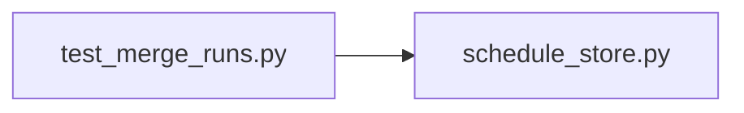

# test_merge_runs.py

저장소 경로 `backend/tests/unit/test_merge_runs.py` 의 관계 노트입니다. `scripts/codegraph.py` 가 생성하므로 직접 수정하지 않습니다.

## imports

- [[graph/backend/src/backend/db/schedule_store|schedule_store.py]]

## imported by

- 없음

## 함수와 호출

- `_row`
- `test_no_rows_produce_no_rows`: `backend.db.schedule_store`
- `test_the_same_team_in_another_room_is_not_joined`: `backend.db.schedule_store`
- `test_rows_out_of_order_are_joined`: `backend.db.schedule_store`
- `test_the_input_is_not_modified`: `backend.db.schedule_store`
