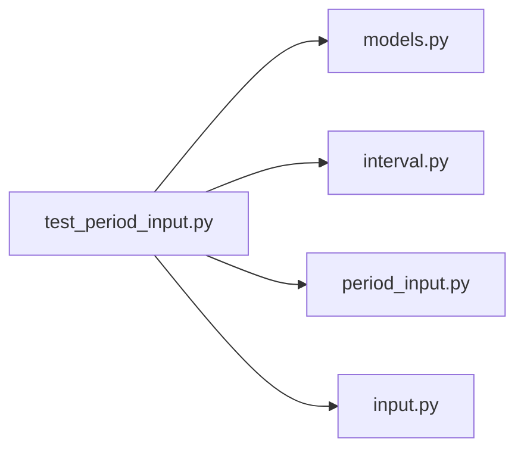

# test_period_input.py

저장소 경로 `backend/tests/unit/test_period_input.py` 의 관계 노트입니다. `scripts/codegraph.py` 가 생성하므로 직접 수정하지 않습니다.

## imports

- [[graph/backend/src/backend/db/models|models.py]]
- [[graph/backend/src/backend/scheduling/interval|interval.py]]
- [[graph/backend/src/backend/services/period/period_input|period_input.py]]
- [[graph/backend/src/backend/services/validation/input|input.py]]

## imported by

- 없음

## 함수와 호출

- `_row`: `backend.db.models`
- `test_dates_in_period_includes_both_ends`: `backend.services.period.period_input`
- `test_single_unavailable_time_is_kept_as_is`: `backend.services.period.period_input`
- `test_unavailable_time_outside_the_window_is_dropped`: `backend.services.period.period_input`
- `test_weekly_repeat_fills_every_seventh_day_inside_the_window`: `backend.services.period.period_input`
- `test_daily_repeat_fills_every_day_inside_the_window`: `backend.services.period.period_input`
- `test_daily_repeat_stops_at_its_repeat_until_date`: `backend.services.period.period_input`
- `test_weekly_repeat_stops_at_its_repeat_until_date`: `backend.services.period.period_input`
- `test_repeats_weekly_none_is_treated_as_not_repeating`: `backend.db.models`, `backend.services.period.period_input`
- `test_unavailable_time_straddling_the_window_start_is_kept`: `backend.services.period.period_input`
- `test_unavailable_time_straddling_the_window_end_is_kept`: `backend.services.period.period_input`
- `test_multiple_unavailable_times_for_the_same_person_are_all_kept`: `backend.services.period.period_input`
- `test_weekly_repeat_that_started_before_the_window_still_lands_inside`: `backend.services.period.period_input`
- `_room`: `backend.db.models`
- `test_each_room_becomes_one_engine_room_per_day`: `backend.services.period.period_input`
- `test_rooms_with_the_same_name_stay_separate`: `backend.services.period.period_input`
- `test_sessions_per_team_is_the_whole_grid_divided_by_team_count`: `backend.services.period.period_input`
- `test_sessions_per_team_counts_the_session_length_not_the_slot`: `backend.services.period.period_input`
- `test_sessions_per_team_is_rejected_when_no_team_can_get_a_session`: `backend.services.period.period_input`
- `test_sessions_per_team_is_rejected_when_there_are_no_teams`: `backend.services.period.period_input`
- `test_two_people_with_the_same_name_stay_separate`: `backend.services.period.period_input`
- `test_the_same_person_in_two_teams_keeps_one_number`: `backend.services.period.period_input`
- `test_unavailable_times_follow_the_person_into_every_team`: `backend.scheduling.interval`, `backend.services.period.period_input`
- `test_the_window_narrows_the_room_hours`: `backend.services.period.period_input`
- `test_the_room_hours_narrow_the_window`: `backend.services.period.period_input`
- `test_weekends_use_their_own_window`: `backend.services.period.period_input`
- `test_a_missing_window_leaves_the_room_hours_alone`: `backend.services.period.period_input`
- `test_a_day_with_no_overlap_produces_no_room`: `backend.services.period.period_input`
- `test_only_the_chosen_weekdays_repeat`: `backend.services.period.period_input`
- `test_a_repeat_count_limits_how_many_times_it_happens`: `backend.services.period.period_input`
- `test_a_repeat_count_counts_weeks_not_single_days`: `backend.services.period.period_input`
- `test_a_repeat_count_of_one_covers_only_the_first_week`: `backend.services.period.period_input`
- `test_a_start_day_outside_the_chosen_weekdays_still_repeats_on_them`: `backend.services.period.period_input`
- `test_sessions_per_team_is_capped_by_days_times_the_daily_limit`: `backend.services.period.period_input`
