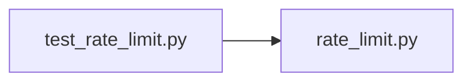

# test_rate_limit.py

저장소 경로 `backend/tests/unit/test_rate_limit.py` 의 관계 노트입니다. `scripts/codegraph.py` 가 생성하므로 직접 수정하지 않습니다.

## imports

- [[graph/backend/src/backend/api/rate_limit|rate_limit.py]]

## imported by

- 없음

## 함수와 호출

- `test_allows_up_to_the_limit`: `backend.api.rate_limit`
- `test_rejects_past_the_limit_and_says_how_long_to_wait`: `backend.api.rate_limit`
- `test_counts_each_caller_separately`: `backend.api.rate_limit`
- `test_forgets_what_fell_out_of_the_window`: `backend.api.rate_limit`
- `test_a_rejected_try_does_not_extend_the_block`: `backend.api.rate_limit`
- `test_does_not_grow_without_bound`: `backend.api.rate_limit`
- `test_rejects_a_limit_that_would_let_everything_through`: `backend.api.rate_limit`
- `_request`
- `test_caller_is_the_peer_when_nothing_is_in_front`: `backend.api.rate_limit`
- `test_caller_is_what_the_proxy_saw_not_what_the_client_claimed`: `backend.api.rate_limit`
- `test_caller_skips_every_trusted_proxy`: `backend.api.rate_limit`
- `test_caller_is_the_peer_when_a_trusted_proxy_was_bypassed`: `backend.api.rate_limit`
- `test_caller_falls_back_when_there_is_no_peer`: `backend.api.rate_limit`
- `test_endpoint_answers_429_with_how_long_to_wait`: `backend.api.rate_limit`
