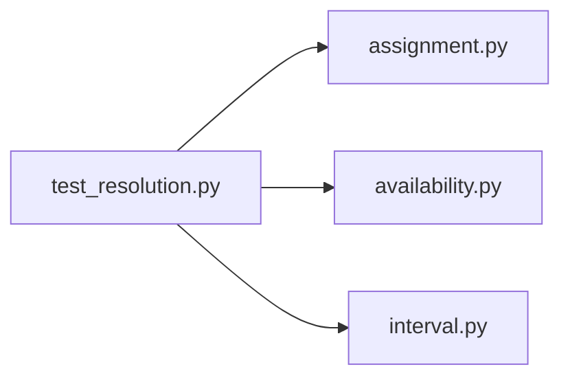

# test_resolution.py

저장소 경로 `backend/tests/unit/test_resolution.py` 의 관계 노트입니다. `scripts/codegraph.py` 가 생성하므로 직접 수정하지 않습니다.

## imports

- [[graph/backend/src/backend/scheduling/assignment|assignment.py]]
- [[graph/backend/src/backend/scheduling/availability|availability.py]]
- [[graph/backend/src/backend/scheduling/interval|interval.py]]

## imported by

- 없음

## 함수와 호출

- `_at`
- `_one_slot_room`: `backend.scheduling.assignment`, `backend.scheduling.interval`
- `test_successful_assignment_returns_no_proposals`: `backend.scheduling.availability`
- `test_proposes_excluding_the_member_who_blocks_the_team`: `backend.scheduling.availability`, `backend.scheduling.interval`
- `test_does_not_propose_excluding_a_member_when_it_would_empty_their_team`: `backend.scheduling.availability`, `backend.scheduling.interval`
- `test_no_proposals_when_no_single_exclusion_can_help`: `backend.scheduling.availability`
- `test_fails_when_the_proposal_search_exceeds_the_time_limit`: `backend.scheduling.availability`, `backend.scheduling.interval`
