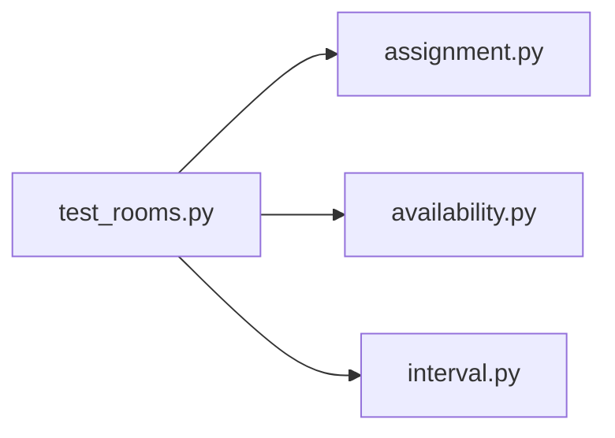

# test_rooms.py

저장소 경로 `backend/tests/unit/test_rooms.py` 의 관계 노트입니다. `scripts/codegraph.py` 가 생성하므로 직접 수정하지 않습니다.

## imports

- [[graph/backend/src/backend/scheduling/assignment|assignment.py]]
- [[graph/backend/src/backend/scheduling/availability|availability.py]]
- [[graph/backend/src/backend/scheduling/interval|interval.py]]

## imported by

- 없음

## 함수와 호출

- `_at`
- `test_team_is_assigned_to_a_room_that_is_open_when_it_can_play`: `backend.scheduling.assignment`, `backend.scheduling.availability`, `backend.scheduling.interval`
- `test_two_teams_cannot_take_the_same_slot_in_the_same_room`: `backend.scheduling.assignment`, `backend.scheduling.availability`, `backend.scheduling.interval`
- `test_two_teams_can_take_the_same_time_in_different_rooms`: `backend.scheduling.assignment`, `backend.scheduling.availability`, `backend.scheduling.interval`
- `test_one_team_cannot_occupy_two_rooms_at_the_same_time`: `backend.scheduling.assignment`, `backend.scheduling.availability`, `backend.scheduling.interval`
- `test_shared_member_cannot_be_in_two_rooms_at_the_same_time`: `backend.scheduling.assignment`, `backend.scheduling.availability`, `backend.scheduling.interval`
- `test_shared_member_can_practice_with_both_teams_at_different_times`: `backend.scheduling.assignment`, `backend.scheduling.availability`, `backend.scheduling.interval`
- `test_two_people_with_the_same_name_are_not_treated_as_one_person`: `backend.scheduling.assignment`, `backend.scheduling.availability`, `backend.scheduling.interval`
- `test_leftover_slots_are_returned_as_open_slots`: `backend.scheduling.assignment`, `backend.scheduling.availability`, `backend.scheduling.interval`
- `test_no_open_slots_when_every_slot_is_used`: `backend.scheduling.assignment`, `backend.scheduling.availability`, `backend.scheduling.interval`
- `test_open_slots_are_empty_when_assignment_fails`: `backend.scheduling.assignment`, `backend.scheduling.availability`, `backend.scheduling.interval`
