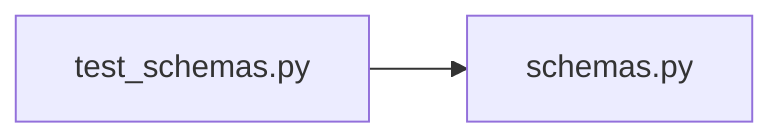

# test_schemas.py

저장소 경로 `backend/tests/unit/test_schemas.py` 의 관계 노트입니다. `scripts/codegraph.py` 가 생성하므로 직접 수정하지 않습니다.

## imports

- [[graph/backend/src/backend/api/schemas|schemas.py]]

## imported by

- 없음

## 함수와 호출

- `test_rejects_a_time_with_an_offset`
- `test_accepts_a_time_without_an_offset`
