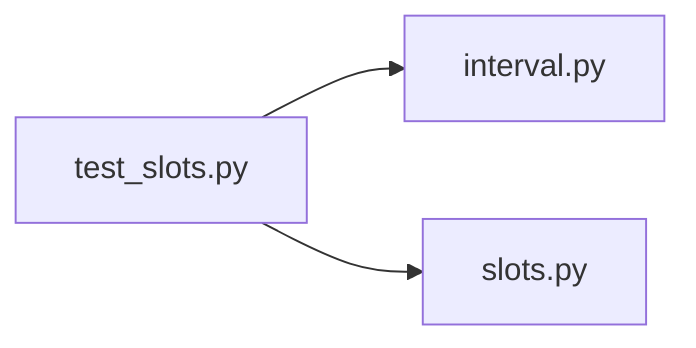

# test_slots.py

저장소 경로 `backend/tests/unit/test_slots.py` 의 관계 노트입니다. `scripts/codegraph.py` 가 생성하므로 직접 수정하지 않습니다.

## imports

- [[graph/backend/src/backend/scheduling/interval|interval.py]]
- [[graph/backend/src/backend/scheduling/slots|slots.py]]

## imported by

- 없음

## 함수와 호출

- `test_open_period_splits_into_one_hour_slots`: `backend.scheduling.interval`, `backend.scheduling.slots`
- `test_rejects_period_that_does_not_start_on_the_grid`: `backend.scheduling.interval`, `backend.scheduling.slots`
- `test_rejects_period_that_does_not_end_on_the_grid`: `backend.scheduling.interval`, `backend.scheduling.slots`
- `test_rejects_period_with_seconds`: `backend.scheduling.interval`, `backend.scheduling.slots`
- `test_long_period_produces_the_exact_number_of_slots`: `backend.scheduling.interval`, `backend.scheduling.slots`
- `test_period_can_cross_midnight`: `backend.scheduling.interval`, `backend.scheduling.slots`
- `test_sessions_start_at_every_slot_boundary`: `backend.scheduling.interval`, `backend.scheduling.slots`
- `test_session_that_would_run_past_the_open_period_is_not_generated`: `backend.scheduling.interval`, `backend.scheduling.slots`
- `test_rejects_session_length_that_is_not_a_multiple_of_the_slot`: `backend.scheduling.interval`, `backend.scheduling.slots`
