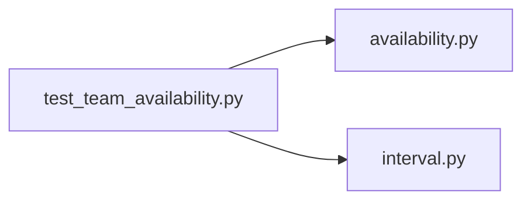

# test_team_availability.py

저장소 경로 `backend/tests/unit/test_team_availability.py` 의 관계 노트입니다. `scripts/codegraph.py` 가 생성하므로 직접 수정하지 않습니다.

## imports

- [[graph/backend/src/backend/scheduling/availability|availability.py]]
- [[graph/backend/src/backend/scheduling/interval|interval.py]]

## imported by

- 없음

## 함수와 호출

- `test_team_unavailable_when_any_member_is_unavailable`: `backend.scheduling.availability`, `backend.scheduling.interval`
- `test_team_available_when_all_members_are_available`: `backend.scheduling.availability`, `backend.scheduling.interval`
