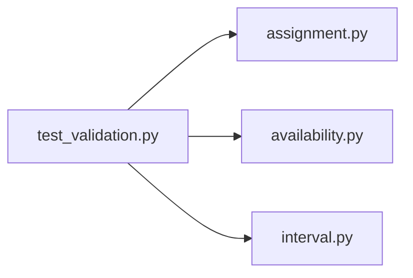

# test_validation.py

저장소 경로 `backend/tests/unit/test_validation.py` 의 관계 노트입니다. `scripts/codegraph.py` 가 생성하므로 직접 수정하지 않습니다.

## imports

- [[graph/backend/src/backend/scheduling/assignment|assignment.py]]
- [[graph/backend/src/backend/scheduling/availability|availability.py]]
- [[graph/backend/src/backend/scheduling/interval|interval.py]]

## imported by

- 없음

## 함수와 호출

- `_at`
- `_room`: `backend.scheduling.assignment`, `backend.scheduling.interval`
- `_team`: `backend.scheduling.availability`
- `test_interval_rejects_end_before_start`: `backend.scheduling.interval`
- `test_interval_rejects_zero_length`: `backend.scheduling.interval`
- `test_interval_rejects_mixed_timezone_awareness`: `backend.scheduling.interval`
- `test_interval_rejects_timezone_aware_values`: `backend.scheduling.interval`
- `test_rejects_the_same_room_opening_twice_over_the_same_time`
- `test_rejects_overlapping_open_periods_for_the_same_room`: `backend.scheduling.assignment`, `backend.scheduling.interval`
- `test_accepts_the_same_room_opening_on_different_days`: `backend.scheduling.assignment`, `backend.scheduling.interval`
- `test_rejects_duplicate_team_ids`
- `test_rejects_a_member_listed_twice_in_the_same_team`: `backend.scheduling.availability`
- `test_rejects_a_team_with_no_members`: `backend.scheduling.availability`
- `test_rejects_negative_sessions_per_team`
