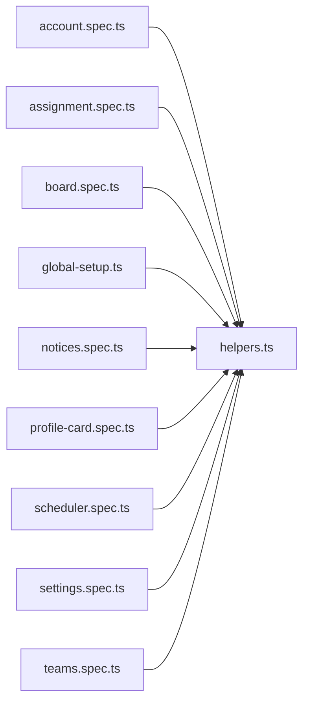

# helpers.ts

저장소 경로 `frontend/e2e/helpers.ts` 의 관계 노트입니다. `scripts/codegraph.py` 가 생성하므로 직접 수정하지 않습니다.

## imports

- 없음

## imported by

- [[graph/frontend/e2e/account.spec|account.spec.ts]]
- [[graph/frontend/e2e/assignment.spec|assignment.spec.ts]]
- [[graph/frontend/e2e/board.spec|board.spec.ts]]
- [[graph/frontend/e2e/global-setup|global-setup.ts]]
- [[graph/frontend/e2e/notices.spec|notices.spec.ts]]
- [[graph/frontend/e2e/profile-card.spec|profile-card.spec.ts]]
- [[graph/frontend/e2e/scheduler.spec|scheduler.spec.ts]]
- [[graph/frontend/e2e/settings.spec|settings.spec.ts]]
- [[graph/frontend/e2e/teams.spec|teams.spec.ts]]
