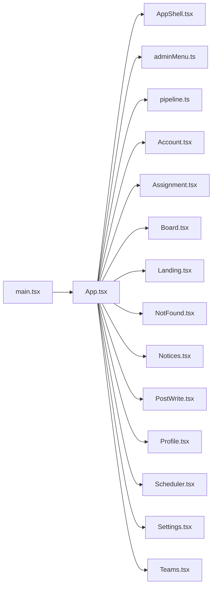

# App.tsx

저장소 경로 `frontend/src/App.tsx` 의 관계 노트입니다. `scripts/codegraph.py` 가 생성하므로 직접 수정하지 않습니다.

## imports

- [[graph/frontend/src/components/AppShell|AppShell.tsx]]
- [[graph/frontend/src/lib/adminMenu|adminMenu.ts]]
- [[graph/frontend/src/lib/pipeline|pipeline.ts]]
- [[graph/frontend/src/routes/Account|Account.tsx]]
- [[graph/frontend/src/routes/Assignment|Assignment.tsx]]
- [[graph/frontend/src/routes/Board|Board.tsx]]
- [[graph/frontend/src/routes/Landing|Landing.tsx]]
- [[graph/frontend/src/routes/NotFound|NotFound.tsx]]
- [[graph/frontend/src/routes/Notices|Notices.tsx]]
- [[graph/frontend/src/routes/PostWrite|PostWrite.tsx]]
- [[graph/frontend/src/routes/Profile|Profile.tsx]]
- [[graph/frontend/src/routes/Scheduler|Scheduler.tsx]]
- [[graph/frontend/src/routes/Settings|Settings.tsx]]
- [[graph/frontend/src/routes/Teams|Teams.tsx]]

## imported by

- [[graph/frontend/src/main|main.tsx]]
