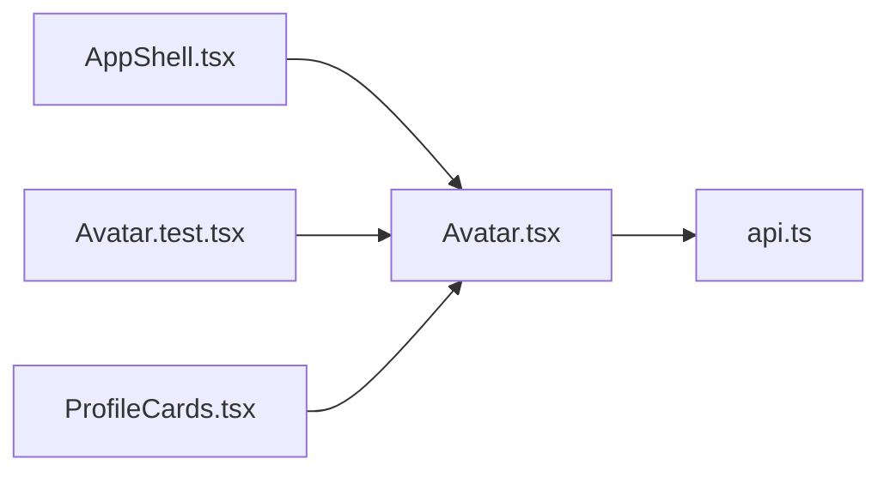

# Avatar.tsx

저장소 경로 `frontend/src/components/Avatar.tsx` 의 관계 노트입니다. `scripts/codegraph.py` 가 생성하므로 직접 수정하지 않습니다.

## imports

- [[graph/frontend/src/lib/api|api.ts]]

## imported by

- [[graph/frontend/src/components/AppShell|AppShell.tsx]]
- [[graph/frontend/src/components/Avatar.test|Avatar.test.tsx]]
- [[graph/frontend/src/routes/ProfileCards|ProfileCards.tsx]]
