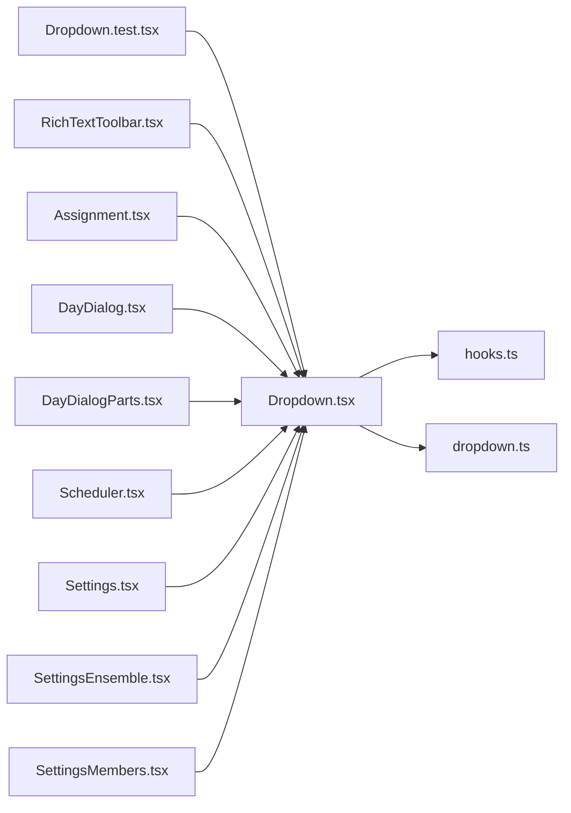

# Dropdown.tsx

저장소 경로 `frontend/src/components/Dropdown.tsx` 의 관계 노트입니다. `scripts/codegraph.py` 가 생성하므로 직접 수정하지 않습니다.

## imports

- [[graph/frontend/src/components/hooks|hooks.ts]]
- [[graph/frontend/src/lib/dropdown|dropdown.ts]]

## imported by

- [[graph/frontend/src/components/Dropdown.test|Dropdown.test.tsx]]
- [[graph/frontend/src/components/RichTextToolbar|RichTextToolbar.tsx]]
- [[graph/frontend/src/routes/Assignment|Assignment.tsx]]
- [[graph/frontend/src/routes/DayDialog|DayDialog.tsx]]
- [[graph/frontend/src/routes/DayDialogParts|DayDialogParts.tsx]]
- [[graph/frontend/src/routes/Scheduler|Scheduler.tsx]]
- [[graph/frontend/src/routes/Settings|Settings.tsx]]
- [[graph/frontend/src/routes/SettingsEnsemble|SettingsEnsemble.tsx]]
- [[graph/frontend/src/routes/SettingsMembers|SettingsMembers.tsx]]
