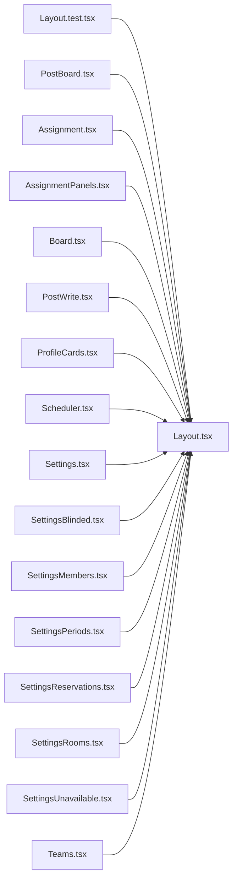

# Layout.tsx

저장소 경로 `frontend/src/components/Layout.tsx` 의 관계 노트입니다. `scripts/codegraph.py` 가 생성하므로 직접 수정하지 않습니다.

## imports

- 없음

## imported by

- [[graph/frontend/src/components/Layout.test|Layout.test.tsx]]
- [[graph/frontend/src/components/PostBoard|PostBoard.tsx]]
- [[graph/frontend/src/routes/Assignment|Assignment.tsx]]
- [[graph/frontend/src/routes/AssignmentPanels|AssignmentPanels.tsx]]
- [[graph/frontend/src/routes/Board|Board.tsx]]
- [[graph/frontend/src/routes/PostWrite|PostWrite.tsx]]
- [[graph/frontend/src/routes/ProfileCards|ProfileCards.tsx]]
- [[graph/frontend/src/routes/Scheduler|Scheduler.tsx]]
- [[graph/frontend/src/routes/Settings|Settings.tsx]]
- [[graph/frontend/src/routes/SettingsBlinded|SettingsBlinded.tsx]]
- [[graph/frontend/src/routes/SettingsMembers|SettingsMembers.tsx]]
- [[graph/frontend/src/routes/SettingsPeriods|SettingsPeriods.tsx]]
- [[graph/frontend/src/routes/SettingsReservations|SettingsReservations.tsx]]
- [[graph/frontend/src/routes/SettingsRooms|SettingsRooms.tsx]]
- [[graph/frontend/src/routes/SettingsUnavailable|SettingsUnavailable.tsx]]
- [[graph/frontend/src/routes/Teams|Teams.tsx]]
