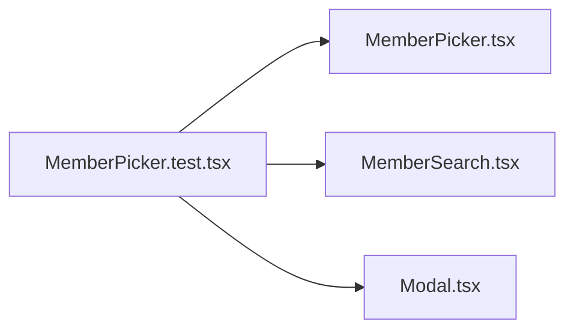

# MemberPicker.test.tsx

저장소 경로 `frontend/src/components/MemberPicker.test.tsx` 의 관계 노트입니다. `scripts/codegraph.py` 가 생성하므로 직접 수정하지 않습니다.

## imports

- [[graph/frontend/src/components/MemberPicker|MemberPicker.tsx]]
- [[graph/frontend/src/components/MemberSearch|MemberSearch.tsx]]
- [[graph/frontend/src/components/Modal|Modal.tsx]]

## imported by

- 없음
