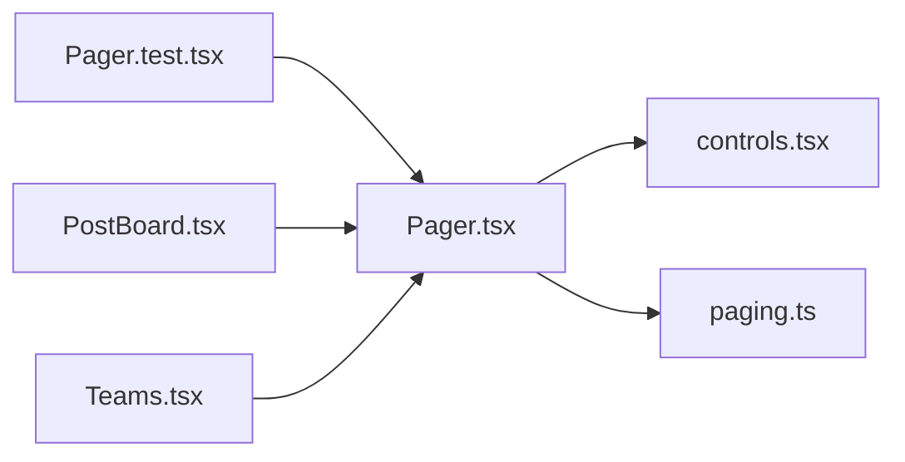

# Pager.tsx

저장소 경로 `frontend/src/components/Pager.tsx` 의 관계 노트입니다. `scripts/codegraph.py` 가 생성하므로 직접 수정하지 않습니다.

## imports

- [[graph/frontend/src/components/controls|controls.tsx]]
- [[graph/frontend/src/lib/paging|paging.ts]]

## imported by

- [[graph/frontend/src/components/Pager.test|Pager.test.tsx]]
- [[graph/frontend/src/components/PostBoard|PostBoard.tsx]]
- [[graph/frontend/src/routes/Teams|Teams.tsx]]
