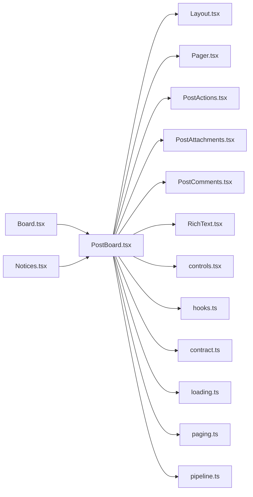

# PostBoard.tsx

저장소 경로 `frontend/src/components/PostBoard.tsx` 의 관계 노트입니다. `scripts/codegraph.py` 가 생성하므로 직접 수정하지 않습니다.

## imports

- [[graph/frontend/src/components/Layout|Layout.tsx]]
- [[graph/frontend/src/components/Pager|Pager.tsx]]
- [[graph/frontend/src/components/PostActions|PostActions.tsx]]
- [[graph/frontend/src/components/PostAttachments|PostAttachments.tsx]]
- [[graph/frontend/src/components/PostComments|PostComments.tsx]]
- [[graph/frontend/src/components/RichText|RichText.tsx]]
- [[graph/frontend/src/components/controls|controls.tsx]]
- [[graph/frontend/src/components/hooks|hooks.ts]]
- [[graph/frontend/src/lib/contract|contract.ts]]
- [[graph/frontend/src/lib/loading|loading.ts]]
- [[graph/frontend/src/lib/paging|paging.ts]]
- [[graph/frontend/src/lib/pipeline|pipeline.ts]]

## imported by

- [[graph/frontend/src/routes/Board|Board.tsx]]
- [[graph/frontend/src/routes/Notices|Notices.tsx]]
