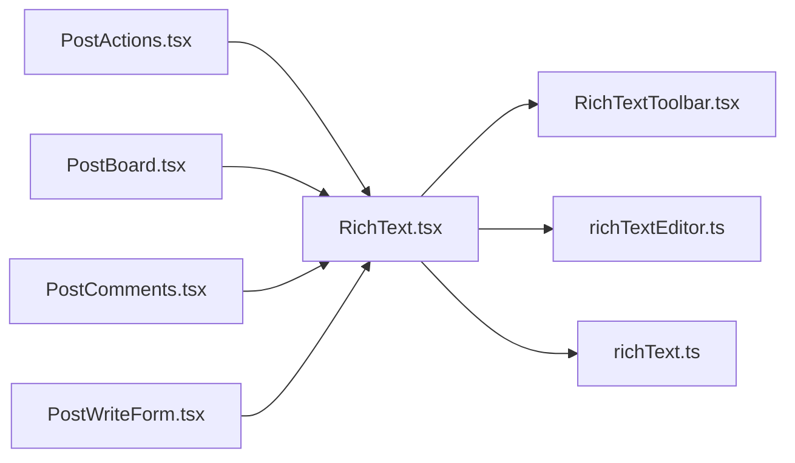

# RichText.tsx

저장소 경로 `frontend/src/components/RichText.tsx` 의 관계 노트입니다. `scripts/codegraph.py` 가 생성하므로 직접 수정하지 않습니다.

## imports

- [[graph/frontend/src/components/RichTextToolbar|RichTextToolbar.tsx]]
- [[graph/frontend/src/components/richTextEditor|richTextEditor.ts]]
- [[graph/frontend/src/lib/richText|richText.ts]]

## imported by

- [[graph/frontend/src/components/PostActions|PostActions.tsx]]
- [[graph/frontend/src/components/PostBoard|PostBoard.tsx]]
- [[graph/frontend/src/components/PostComments|PostComments.tsx]]
- [[graph/frontend/src/components/PostWriteForm|PostWriteForm.tsx]]
