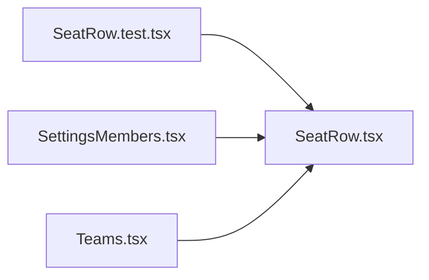

# SeatRow.tsx

저장소 경로 `frontend/src/components/SeatRow.tsx` 의 관계 노트입니다. `scripts/codegraph.py` 가 생성하므로 직접 수정하지 않습니다.

## imports

- 없음

## imported by

- [[graph/frontend/src/components/SeatRow.test|SeatRow.test.tsx]]
- [[graph/frontend/src/routes/SettingsMembers|SettingsMembers.tsx]]
- [[graph/frontend/src/routes/Teams|Teams.tsx]]
