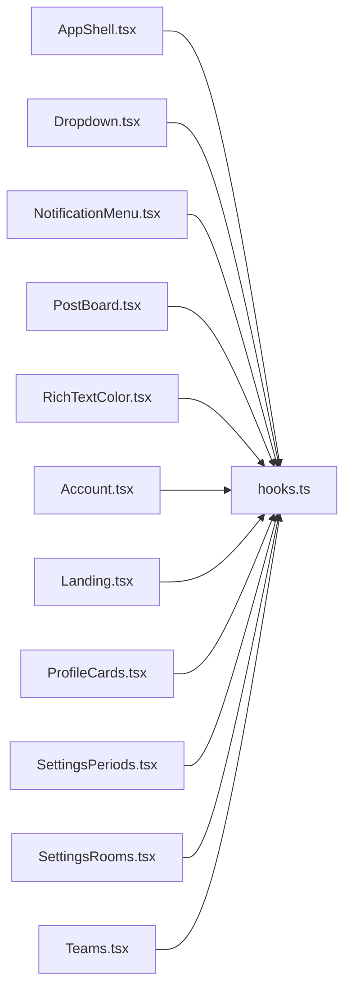

# hooks.ts

저장소 경로 `frontend/src/components/hooks.ts` 의 관계 노트입니다. `scripts/codegraph.py` 가 생성하므로 직접 수정하지 않습니다.

## imports

- 없음

## imported by

- [[graph/frontend/src/components/AppShell|AppShell.tsx]]
- [[graph/frontend/src/components/Dropdown|Dropdown.tsx]]
- [[graph/frontend/src/components/NotificationMenu|NotificationMenu.tsx]]
- [[graph/frontend/src/components/PostBoard|PostBoard.tsx]]
- [[graph/frontend/src/components/RichTextColor|RichTextColor.tsx]]
- [[graph/frontend/src/routes/Account|Account.tsx]]
- [[graph/frontend/src/routes/Landing|Landing.tsx]]
- [[graph/frontend/src/routes/ProfileCards|ProfileCards.tsx]]
- [[graph/frontend/src/routes/SettingsPeriods|SettingsPeriods.tsx]]
- [[graph/frontend/src/routes/SettingsRooms|SettingsRooms.tsx]]
- [[graph/frontend/src/routes/Teams|Teams.tsx]]
