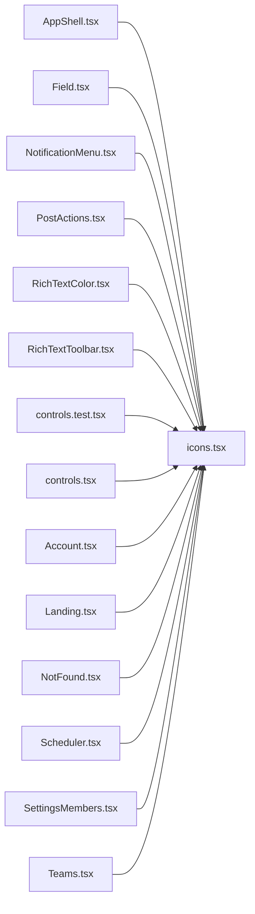

# icons.tsx

저장소 경로 `frontend/src/components/icons.tsx` 의 관계 노트입니다. `scripts/codegraph.py` 가 생성하므로 직접 수정하지 않습니다.

## imports

- 없음

## imported by

- [[graph/frontend/src/components/AppShell|AppShell.tsx]]
- [[graph/frontend/src/components/Field|Field.tsx]]
- [[graph/frontend/src/components/NotificationMenu|NotificationMenu.tsx]]
- [[graph/frontend/src/components/PostActions|PostActions.tsx]]
- [[graph/frontend/src/components/RichTextColor|RichTextColor.tsx]]
- [[graph/frontend/src/components/RichTextToolbar|RichTextToolbar.tsx]]
- [[graph/frontend/src/components/controls.test|controls.test.tsx]]
- [[graph/frontend/src/components/controls|controls.tsx]]
- [[graph/frontend/src/routes/Account|Account.tsx]]
- [[graph/frontend/src/routes/Landing|Landing.tsx]]
- [[graph/frontend/src/routes/NotFound|NotFound.tsx]]
- [[graph/frontend/src/routes/Scheduler|Scheduler.tsx]]
- [[graph/frontend/src/routes/SettingsMembers|SettingsMembers.tsx]]
- [[graph/frontend/src/routes/Teams|Teams.tsx]]
