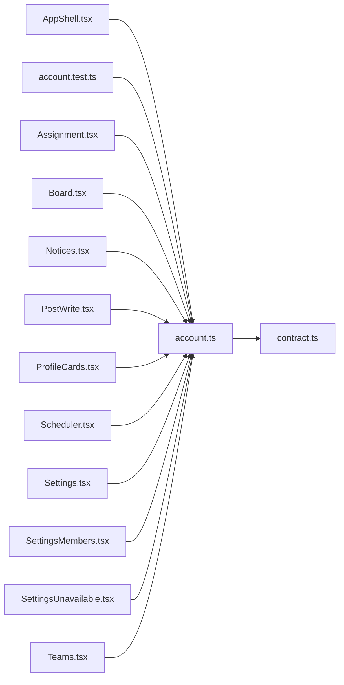

# account.ts

저장소 경로 `frontend/src/lib/account.ts` 의 관계 노트입니다. `scripts/codegraph.py` 가 생성하므로 직접 수정하지 않습니다.

## imports

- [[graph/frontend/src/lib/contract|contract.ts]]

## imported by

- [[graph/frontend/src/components/AppShell|AppShell.tsx]]
- [[graph/frontend/src/lib/account.test|account.test.ts]]
- [[graph/frontend/src/routes/Assignment|Assignment.tsx]]
- [[graph/frontend/src/routes/Board|Board.tsx]]
- [[graph/frontend/src/routes/Notices|Notices.tsx]]
- [[graph/frontend/src/routes/PostWrite|PostWrite.tsx]]
- [[graph/frontend/src/routes/ProfileCards|ProfileCards.tsx]]
- [[graph/frontend/src/routes/Scheduler|Scheduler.tsx]]
- [[graph/frontend/src/routes/Settings|Settings.tsx]]
- [[graph/frontend/src/routes/SettingsMembers|SettingsMembers.tsx]]
- [[graph/frontend/src/routes/SettingsUnavailable|SettingsUnavailable.tsx]]
- [[graph/frontend/src/routes/Teams|Teams.tsx]]
