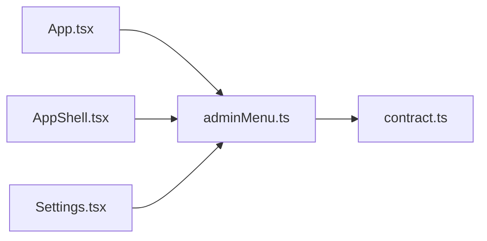

# adminMenu.ts

저장소 경로 `frontend/src/lib/adminMenu.ts` 의 관계 노트입니다. `scripts/codegraph.py` 가 생성하므로 직접 수정하지 않습니다.

## imports

- [[graph/frontend/src/lib/contract|contract.ts]]

## imported by

- [[graph/frontend/src/App|App.tsx]]
- [[graph/frontend/src/components/AppShell|AppShell.tsx]]
- [[graph/frontend/src/routes/Settings|Settings.tsx]]
