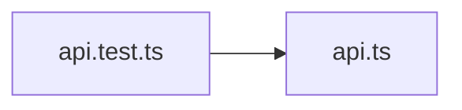

# api.test.ts

저장소 경로 `frontend/src/lib/api.test.ts` 의 관계 노트입니다. `scripts/codegraph.py` 가 생성하므로 직접 수정하지 않습니다.

```mermaid
flowchart LR
  frontend_src_lib_api_test["api.test.ts"]
  frontend_src_lib_api_test --> frontend_src_lib_api["api.ts"]
```

## imports

- [[graph/frontend/src/lib/api|api.ts]]

## imported by

- 없음
