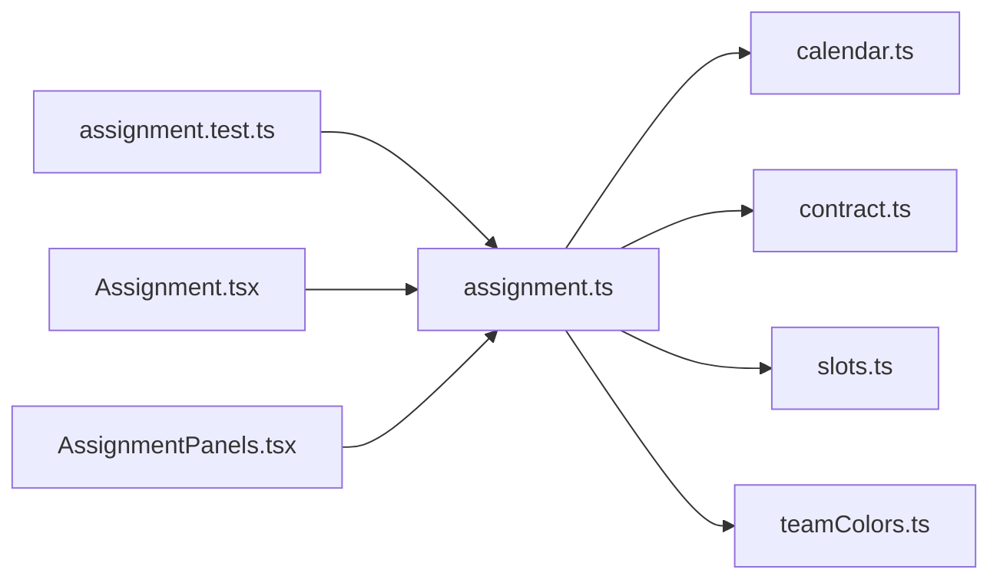

# assignment.ts

저장소 경로 `frontend/src/lib/assignment.ts` 의 관계 노트입니다. `scripts/codegraph.py` 가 생성하므로 직접 수정하지 않습니다.

## imports

- [[graph/frontend/src/lib/calendar|calendar.ts]]
- [[graph/frontend/src/lib/contract|contract.ts]]
- [[graph/frontend/src/lib/slots|slots.ts]]
- [[graph/frontend/src/lib/teamColors|teamColors.ts]]

## imported by

- [[graph/frontend/src/lib/assignment.test|assignment.test.ts]]
- [[graph/frontend/src/routes/Assignment|Assignment.tsx]]
- [[graph/frontend/src/routes/AssignmentPanels|AssignmentPanels.tsx]]
