# contract.ts

저장소 경로 `frontend/src/lib/contract.ts` 의 관계 노트입니다. `scripts/codegraph.py` 가 생성하므로 직접 수정하지 않습니다.

```mermaid
flowchart LR
  frontend_src_lib_contract["contract.ts"]
  frontend_src_components_AppShell["AppShell.tsx"] --> frontend_src_lib_contract
  frontend_src_components_MemberPicker["MemberPicker.tsx"] --> frontend_src_lib_contract
  frontend_src_components_MemberSearch_test["MemberSearch.test.tsx"] --> frontend_src_lib_contract
  frontend_src_components_MemberSearch["MemberSearch.tsx"] --> frontend_src_lib_contract
  frontend_src_components_PostActions["PostActions.tsx"] --> frontend_src_lib_contract
  frontend_src_components_PostAttachments["PostAttachments.tsx"] --> frontend_src_lib_contract
  frontend_src_components_PostBoard["PostBoard.tsx"] --> frontend_src_lib_contract
  frontend_src_components_PostComments["PostComments.tsx"] --> frontend_src_lib_contract
  frontend_src_components_PostWriteForm["PostWriteForm.tsx"] --> frontend_src_lib_contract
  frontend_src_components_RejectDialog["RejectDialog.tsx"] --> frontend_src_lib_contract
  frontend_src_components_queries["queries.ts"] --> frontend_src_lib_contract
  frontend_src_lib_account_test["account.test.ts"] --> frontend_src_lib_contract
  frontend_src_lib_account["account.ts"] --> frontend_src_lib_contract
  frontend_src_lib_adminMenu["adminMenu.ts"] --> frontend_src_lib_contract
  frontend_src_lib_assignment_test["assignment.test.ts"] --> frontend_src_lib_contract
  frontend_src_lib_assignment["assignment.ts"] --> frontend_src_lib_contract
  frontend_src_lib_dayEntries_test["dayEntries.test.ts"] --> frontend_src_lib_contract
  frontend_src_lib_dayEntries["dayEntries.ts"] --> frontend_src_lib_contract
  frontend_src_lib_notifications_test["notifications.test.ts"] --> frontend_src_lib_contract
  frontend_src_lib_notifications["notifications.ts"] --> frontend_src_lib_contract
  frontend_src_lib_pipeline["pipeline.ts"] --> frontend_src_lib_contract
  frontend_src_lib_roster_test["roster.test.ts"] --> frontend_src_lib_contract
  frontend_src_lib_roster["roster.ts"] --> frontend_src_lib_contract
  frontend_src_routes_Assignment["Assignment.tsx"] --> frontend_src_lib_contract
  frontend_src_routes_AssignmentPanels["AssignmentPanels.tsx"] --> frontend_src_lib_contract
  frontend_src_routes_DayDialog["DayDialog.tsx"] --> frontend_src_lib_contract
  frontend_src_routes_PostWrite["PostWrite.tsx"] --> frontend_src_lib_contract
  frontend_src_routes_Profile["Profile.tsx"] --> frontend_src_lib_contract
  frontend_src_routes_ProfileCards["ProfileCards.tsx"] --> frontend_src_lib_contract
  frontend_src_routes_Scheduler["Scheduler.tsx"] --> frontend_src_lib_contract
  frontend_src_routes_Settings["Settings.tsx"] --> frontend_src_lib_contract
  frontend_src_routes_SettingsBlinded["SettingsBlinded.tsx"] --> frontend_src_lib_contract
  frontend_src_routes_SettingsEnsemble["SettingsEnsemble.tsx"] --> frontend_src_lib_contract
  frontend_src_routes_SettingsMembers["SettingsMembers.tsx"] --> frontend_src_lib_contract
  frontend_src_routes_SettingsPeriods["SettingsPeriods.tsx"] --> frontend_src_lib_contract
  frontend_src_routes_SettingsRooms["SettingsRooms.tsx"] --> frontend_src_lib_contract
  frontend_src_routes_SettingsUnavailable["SettingsUnavailable.tsx"] --> frontend_src_lib_contract
  frontend_src_routes_Teams["Teams.tsx"] --> frontend_src_lib_contract
```

## imports

- 없음

## imported by

- [[graph/frontend/src/components/AppShell|AppShell.tsx]]
- [[graph/frontend/src/components/MemberPicker|MemberPicker.tsx]]
- [[graph/frontend/src/components/MemberSearch.test|MemberSearch.test.tsx]]
- [[graph/frontend/src/components/MemberSearch|MemberSearch.tsx]]
- [[graph/frontend/src/components/PostActions|PostActions.tsx]]
- [[graph/frontend/src/components/PostAttachments|PostAttachments.tsx]]
- [[graph/frontend/src/components/PostBoard|PostBoard.tsx]]
- [[graph/frontend/src/components/PostComments|PostComments.tsx]]
- [[graph/frontend/src/components/PostWriteForm|PostWriteForm.tsx]]
- [[graph/frontend/src/components/RejectDialog|RejectDialog.tsx]]
- [[graph/frontend/src/components/queries|queries.ts]]
- [[graph/frontend/src/lib/account.test|account.test.ts]]
- [[graph/frontend/src/lib/account|account.ts]]
- [[graph/frontend/src/lib/adminMenu|adminMenu.ts]]
- [[graph/frontend/src/lib/assignment.test|assignment.test.ts]]
- [[graph/frontend/src/lib/assignment|assignment.ts]]
- [[graph/frontend/src/lib/dayEntries.test|dayEntries.test.ts]]
- [[graph/frontend/src/lib/dayEntries|dayEntries.ts]]
- [[graph/frontend/src/lib/notifications.test|notifications.test.ts]]
- [[graph/frontend/src/lib/notifications|notifications.ts]]
- [[graph/frontend/src/lib/pipeline|pipeline.ts]]
- [[graph/frontend/src/lib/roster.test|roster.test.ts]]
- [[graph/frontend/src/lib/roster|roster.ts]]
- [[graph/frontend/src/routes/Assignment|Assignment.tsx]]
- [[graph/frontend/src/routes/AssignmentPanels|AssignmentPanels.tsx]]
- [[graph/frontend/src/routes/DayDialog|DayDialog.tsx]]
- [[graph/frontend/src/routes/PostWrite|PostWrite.tsx]]
- [[graph/frontend/src/routes/Profile|Profile.tsx]]
- [[graph/frontend/src/routes/ProfileCards|ProfileCards.tsx]]
- [[graph/frontend/src/routes/Scheduler|Scheduler.tsx]]
- [[graph/frontend/src/routes/Settings|Settings.tsx]]
- [[graph/frontend/src/routes/SettingsBlinded|SettingsBlinded.tsx]]
- [[graph/frontend/src/routes/SettingsEnsemble|SettingsEnsemble.tsx]]
- [[graph/frontend/src/routes/SettingsMembers|SettingsMembers.tsx]]
- [[graph/frontend/src/routes/SettingsPeriods|SettingsPeriods.tsx]]
- [[graph/frontend/src/routes/SettingsRooms|SettingsRooms.tsx]]
- [[graph/frontend/src/routes/SettingsUnavailable|SettingsUnavailable.tsx]]
- [[graph/frontend/src/routes/Teams|Teams.tsx]]
