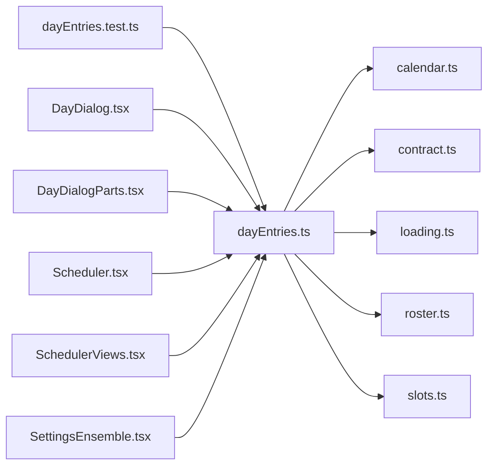

# dayEntries.ts

저장소 경로 `frontend/src/lib/dayEntries.ts` 의 관계 노트입니다. `scripts/codegraph.py` 가 생성하므로 직접 수정하지 않습니다.

## imports

- [[graph/frontend/src/lib/calendar|calendar.ts]]
- [[graph/frontend/src/lib/contract|contract.ts]]
- [[graph/frontend/src/lib/loading|loading.ts]]
- [[graph/frontend/src/lib/roster|roster.ts]]
- [[graph/frontend/src/lib/slots|slots.ts]]

## imported by

- [[graph/frontend/src/lib/dayEntries.test|dayEntries.test.ts]]
- [[graph/frontend/src/routes/DayDialog|DayDialog.tsx]]
- [[graph/frontend/src/routes/DayDialogParts|DayDialogParts.tsx]]
- [[graph/frontend/src/routes/Scheduler|Scheduler.tsx]]
- [[graph/frontend/src/routes/SchedulerViews|SchedulerViews.tsx]]
- [[graph/frontend/src/routes/SettingsEnsemble|SettingsEnsemble.tsx]]
