# loading.ts

저장소 경로 `frontend/src/lib/loading.ts` 의 관계 노트입니다. `scripts/codegraph.py` 가 생성하므로 직접 수정하지 않습니다.

```mermaid
flowchart LR
  frontend_src_lib_loading["loading.ts"]
  frontend_src_lib_loading --> frontend_src_lib_api["api.ts"]
  frontend_src_components_AppShell["AppShell.tsx"] --> frontend_src_lib_loading
  frontend_src_components_MemberSearch_test["MemberSearch.test.tsx"] --> frontend_src_lib_loading
  frontend_src_components_MemberSearch["MemberSearch.tsx"] --> frontend_src_lib_loading
  frontend_src_components_NotificationMenu["NotificationMenu.tsx"] --> frontend_src_lib_loading
  frontend_src_components_PostActions["PostActions.tsx"] --> frontend_src_lib_loading
  frontend_src_components_PostAttachments["PostAttachments.tsx"] --> frontend_src_lib_loading
  frontend_src_components_PostBoard["PostBoard.tsx"] --> frontend_src_lib_loading
  frontend_src_components_PostComments["PostComments.tsx"] --> frontend_src_lib_loading
  frontend_src_components_PostWriteForm["PostWriteForm.tsx"] --> frontend_src_lib_loading
  frontend_src_components_RejectDialog["RejectDialog.tsx"] --> frontend_src_lib_loading
  frontend_src_components_controls["controls.tsx"] --> frontend_src_lib_loading
  frontend_src_components_queries["queries.ts"] --> frontend_src_lib_loading
  frontend_src_lib_dayEntries["dayEntries.ts"] --> frontend_src_lib_loading
  frontend_src_lib_loading_test["loading.test.ts"] --> frontend_src_lib_loading
  frontend_src_routes_AssignmentPanels["AssignmentPanels.tsx"] --> frontend_src_lib_loading
  frontend_src_routes_Board["Board.tsx"] --> frontend_src_lib_loading
  frontend_src_routes_PostWrite["PostWrite.tsx"] --> frontend_src_lib_loading
  frontend_src_routes_Profile["Profile.tsx"] --> frontend_src_lib_loading
  frontend_src_routes_Scheduler["Scheduler.tsx"] --> frontend_src_lib_loading
  frontend_src_routes_Settings["Settings.tsx"] --> frontend_src_lib_loading
  frontend_src_routes_SettingsBlinded["SettingsBlinded.tsx"] --> frontend_src_lib_loading
  frontend_src_routes_SettingsEnsemble["SettingsEnsemble.tsx"] --> frontend_src_lib_loading
  frontend_src_routes_SettingsMembers["SettingsMembers.tsx"] --> frontend_src_lib_loading
  frontend_src_routes_SettingsPeriods["SettingsPeriods.tsx"] --> frontend_src_lib_loading
  frontend_src_routes_SettingsReservations["SettingsReservations.tsx"] --> frontend_src_lib_loading
  frontend_src_routes_SettingsRooms["SettingsRooms.tsx"] --> frontend_src_lib_loading
  frontend_src_routes_Teams["Teams.tsx"] --> frontend_src_lib_loading
```

## imports

- [[graph/frontend/src/lib/api|api.ts]]

## imported by

- [[graph/frontend/src/components/AppShell|AppShell.tsx]]
- [[graph/frontend/src/components/MemberSearch.test|MemberSearch.test.tsx]]
- [[graph/frontend/src/components/MemberSearch|MemberSearch.tsx]]
- [[graph/frontend/src/components/NotificationMenu|NotificationMenu.tsx]]
- [[graph/frontend/src/components/PostActions|PostActions.tsx]]
- [[graph/frontend/src/components/PostAttachments|PostAttachments.tsx]]
- [[graph/frontend/src/components/PostBoard|PostBoard.tsx]]
- [[graph/frontend/src/components/PostComments|PostComments.tsx]]
- [[graph/frontend/src/components/PostWriteForm|PostWriteForm.tsx]]
- [[graph/frontend/src/components/RejectDialog|RejectDialog.tsx]]
- [[graph/frontend/src/components/controls|controls.tsx]]
- [[graph/frontend/src/components/queries|queries.ts]]
- [[graph/frontend/src/lib/dayEntries|dayEntries.ts]]
- [[graph/frontend/src/lib/loading.test|loading.test.ts]]
- [[graph/frontend/src/routes/AssignmentPanels|AssignmentPanels.tsx]]
- [[graph/frontend/src/routes/Board|Board.tsx]]
- [[graph/frontend/src/routes/PostWrite|PostWrite.tsx]]
- [[graph/frontend/src/routes/Profile|Profile.tsx]]
- [[graph/frontend/src/routes/Scheduler|Scheduler.tsx]]
- [[graph/frontend/src/routes/Settings|Settings.tsx]]
- [[graph/frontend/src/routes/SettingsBlinded|SettingsBlinded.tsx]]
- [[graph/frontend/src/routes/SettingsEnsemble|SettingsEnsemble.tsx]]
- [[graph/frontend/src/routes/SettingsMembers|SettingsMembers.tsx]]
- [[graph/frontend/src/routes/SettingsPeriods|SettingsPeriods.tsx]]
- [[graph/frontend/src/routes/SettingsReservations|SettingsReservations.tsx]]
- [[graph/frontend/src/routes/SettingsRooms|SettingsRooms.tsx]]
- [[graph/frontend/src/routes/Teams|Teams.tsx]]
