# pipeline.ts

저장소 경로 `frontend/src/lib/pipeline.ts` 의 관계 노트입니다. `scripts/codegraph.py` 가 생성하므로 직접 수정하지 않습니다.

```mermaid
flowchart LR
  frontend_src_lib_pipeline["pipeline.ts"]
  frontend_src_lib_pipeline --> frontend_src_lib_api["api.ts"]
  frontend_src_lib_pipeline --> frontend_src_lib_boards["boards.ts"]
  frontend_src_lib_pipeline --> frontend_src_lib_calendar["calendar.ts"]
  frontend_src_lib_pipeline --> frontend_src_lib_contract["contract.ts"]
  frontend_src_lib_pipeline --> frontend_src_lib_jobs["jobs.ts"]
  frontend_src_lib_pipeline --> frontend_src_lib_notifications["notifications.ts"]
  frontend_src_lib_pipeline --> frontend_src_lib_roster["roster.ts"]
  frontend_src_lib_pipeline --> frontend_src_lib_settings["settings.ts"]
  frontend_src_lib_pipeline --> frontend_src_lib_slots["slots.ts"]
  frontend_src_lib_pipeline --> frontend_src_lib_validate["validate.ts"]
  frontend_src_App["App.tsx"] --> frontend_src_lib_pipeline
  frontend_src_components_AppShell["AppShell.tsx"] --> frontend_src_lib_pipeline
  frontend_src_components_MemberSearch["MemberSearch.tsx"] --> frontend_src_lib_pipeline
  frontend_src_components_NotificationMenu["NotificationMenu.tsx"] --> frontend_src_lib_pipeline
  frontend_src_components_PostActions["PostActions.tsx"] --> frontend_src_lib_pipeline
  frontend_src_components_PostAttachments["PostAttachments.tsx"] --> frontend_src_lib_pipeline
  frontend_src_components_PostBoard["PostBoard.tsx"] --> frontend_src_lib_pipeline
  frontend_src_components_PostComments["PostComments.tsx"] --> frontend_src_lib_pipeline
  frontend_src_components_PostWriteForm["PostWriteForm.tsx"] --> frontend_src_lib_pipeline
  frontend_src_components_queries["queries.ts"] --> frontend_src_lib_pipeline
  frontend_src_lib_pipeline_test["pipeline.test.ts"] --> frontend_src_lib_pipeline
  frontend_src_routes_Account["Account.tsx"] --> frontend_src_lib_pipeline
  frontend_src_routes_Assignment["Assignment.tsx"] --> frontend_src_lib_pipeline
  frontend_src_routes_AssignmentPanels["AssignmentPanels.tsx"] --> frontend_src_lib_pipeline
  frontend_src_routes_DayDialog["DayDialog.tsx"] --> frontend_src_lib_pipeline
  frontend_src_routes_DayDialogParts["DayDialogParts.tsx"] --> frontend_src_lib_pipeline
  frontend_src_routes_PostWrite["PostWrite.tsx"] --> frontend_src_lib_pipeline
  frontend_src_routes_Profile["Profile.tsx"] --> frontend_src_lib_pipeline
  frontend_src_routes_Scheduler["Scheduler.tsx"] --> frontend_src_lib_pipeline
  frontend_src_routes_SchedulerViews["SchedulerViews.tsx"] --> frontend_src_lib_pipeline
  frontend_src_routes_Settings["Settings.tsx"] --> frontend_src_lib_pipeline
  frontend_src_routes_SettingsBlinded["SettingsBlinded.tsx"] --> frontend_src_lib_pipeline
  frontend_src_routes_SettingsEnsemble["SettingsEnsemble.tsx"] --> frontend_src_lib_pipeline
  frontend_src_routes_SettingsMembers["SettingsMembers.tsx"] --> frontend_src_lib_pipeline
  frontend_src_routes_SettingsPeriods["SettingsPeriods.tsx"] --> frontend_src_lib_pipeline
  frontend_src_routes_SettingsReservations["SettingsReservations.tsx"] --> frontend_src_lib_pipeline
  frontend_src_routes_SettingsRooms["SettingsRooms.tsx"] --> frontend_src_lib_pipeline
  frontend_src_routes_SettingsUnavailable["SettingsUnavailable.tsx"] --> frontend_src_lib_pipeline
  frontend_src_routes_Teams["Teams.tsx"] --> frontend_src_lib_pipeline
```

## imports

- [[graph/frontend/src/lib/api|api.ts]]
- [[graph/frontend/src/lib/boards|boards.ts]]
- [[graph/frontend/src/lib/calendar|calendar.ts]]
- [[graph/frontend/src/lib/contract|contract.ts]]
- [[graph/frontend/src/lib/jobs|jobs.ts]]
- [[graph/frontend/src/lib/notifications|notifications.ts]]
- [[graph/frontend/src/lib/roster|roster.ts]]
- [[graph/frontend/src/lib/settings|settings.ts]]
- [[graph/frontend/src/lib/slots|slots.ts]]
- [[graph/frontend/src/lib/validate|validate.ts]]

## imported by

- [[graph/frontend/src/App|App.tsx]]
- [[graph/frontend/src/components/AppShell|AppShell.tsx]]
- [[graph/frontend/src/components/MemberSearch|MemberSearch.tsx]]
- [[graph/frontend/src/components/NotificationMenu|NotificationMenu.tsx]]
- [[graph/frontend/src/components/PostActions|PostActions.tsx]]
- [[graph/frontend/src/components/PostAttachments|PostAttachments.tsx]]
- [[graph/frontend/src/components/PostBoard|PostBoard.tsx]]
- [[graph/frontend/src/components/PostComments|PostComments.tsx]]
- [[graph/frontend/src/components/PostWriteForm|PostWriteForm.tsx]]
- [[graph/frontend/src/components/queries|queries.ts]]
- [[graph/frontend/src/lib/pipeline.test|pipeline.test.ts]]
- [[graph/frontend/src/routes/Account|Account.tsx]]
- [[graph/frontend/src/routes/Assignment|Assignment.tsx]]
- [[graph/frontend/src/routes/AssignmentPanels|AssignmentPanels.tsx]]
- [[graph/frontend/src/routes/DayDialog|DayDialog.tsx]]
- [[graph/frontend/src/routes/DayDialogParts|DayDialogParts.tsx]]
- [[graph/frontend/src/routes/PostWrite|PostWrite.tsx]]
- [[graph/frontend/src/routes/Profile|Profile.tsx]]
- [[graph/frontend/src/routes/Scheduler|Scheduler.tsx]]
- [[graph/frontend/src/routes/SchedulerViews|SchedulerViews.tsx]]
- [[graph/frontend/src/routes/Settings|Settings.tsx]]
- [[graph/frontend/src/routes/SettingsBlinded|SettingsBlinded.tsx]]
- [[graph/frontend/src/routes/SettingsEnsemble|SettingsEnsemble.tsx]]
- [[graph/frontend/src/routes/SettingsMembers|SettingsMembers.tsx]]
- [[graph/frontend/src/routes/SettingsPeriods|SettingsPeriods.tsx]]
- [[graph/frontend/src/routes/SettingsReservations|SettingsReservations.tsx]]
- [[graph/frontend/src/routes/SettingsRooms|SettingsRooms.tsx]]
- [[graph/frontend/src/routes/SettingsUnavailable|SettingsUnavailable.tsx]]
- [[graph/frontend/src/routes/Teams|Teams.tsx]]
