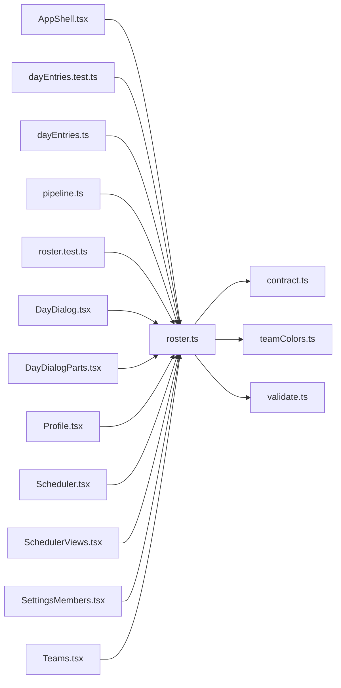

# roster.ts

저장소 경로 `frontend/src/lib/roster.ts` 의 관계 노트입니다. `scripts/codegraph.py` 가 생성하므로 직접 수정하지 않습니다.

## imports

- [[graph/frontend/src/lib/contract|contract.ts]]
- [[graph/frontend/src/lib/teamColors|teamColors.ts]]
- [[graph/frontend/src/lib/validate|validate.ts]]

## imported by

- [[graph/frontend/src/components/AppShell|AppShell.tsx]]
- [[graph/frontend/src/lib/dayEntries.test|dayEntries.test.ts]]
- [[graph/frontend/src/lib/dayEntries|dayEntries.ts]]
- [[graph/frontend/src/lib/pipeline|pipeline.ts]]
- [[graph/frontend/src/lib/roster.test|roster.test.ts]]
- [[graph/frontend/src/routes/DayDialog|DayDialog.tsx]]
- [[graph/frontend/src/routes/DayDialogParts|DayDialogParts.tsx]]
- [[graph/frontend/src/routes/Profile|Profile.tsx]]
- [[graph/frontend/src/routes/Scheduler|Scheduler.tsx]]
- [[graph/frontend/src/routes/SchedulerViews|SchedulerViews.tsx]]
- [[graph/frontend/src/routes/SettingsMembers|SettingsMembers.tsx]]
- [[graph/frontend/src/routes/Teams|Teams.tsx]]
