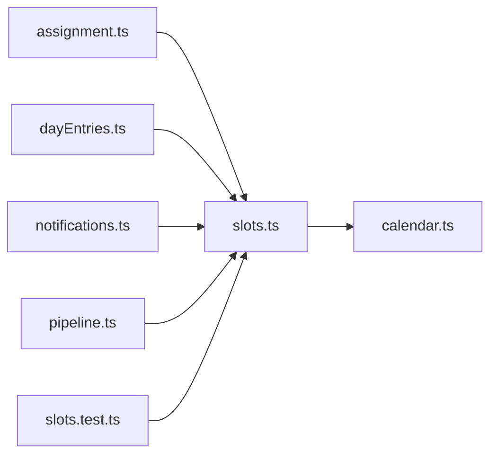

# slots.ts

저장소 경로 `frontend/src/lib/slots.ts` 의 관계 노트입니다. `scripts/codegraph.py` 가 생성하므로 직접 수정하지 않습니다.

## imports

- [[graph/frontend/src/lib/calendar|calendar.ts]]

## imported by

- [[graph/frontend/src/lib/assignment|assignment.ts]]
- [[graph/frontend/src/lib/dayEntries|dayEntries.ts]]
- [[graph/frontend/src/lib/notifications|notifications.ts]]
- [[graph/frontend/src/lib/pipeline|pipeline.ts]]
- [[graph/frontend/src/lib/slots.test|slots.test.ts]]
