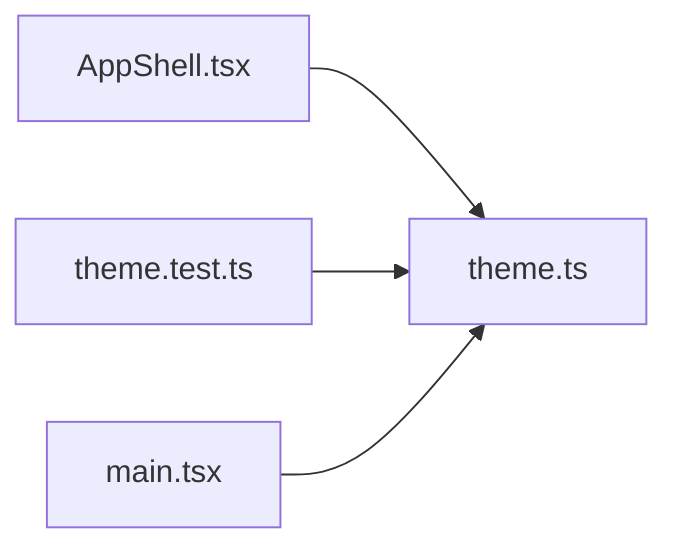

# theme.ts

저장소 경로 `frontend/src/lib/theme.ts` 의 관계 노트입니다. `scripts/codegraph.py` 가 생성하므로 직접 수정하지 않습니다.

## imports

- 없음

## imported by

- [[graph/frontend/src/components/AppShell|AppShell.tsx]]
- [[graph/frontend/src/lib/theme.test|theme.test.ts]]
- [[graph/frontend/src/main|main.tsx]]
