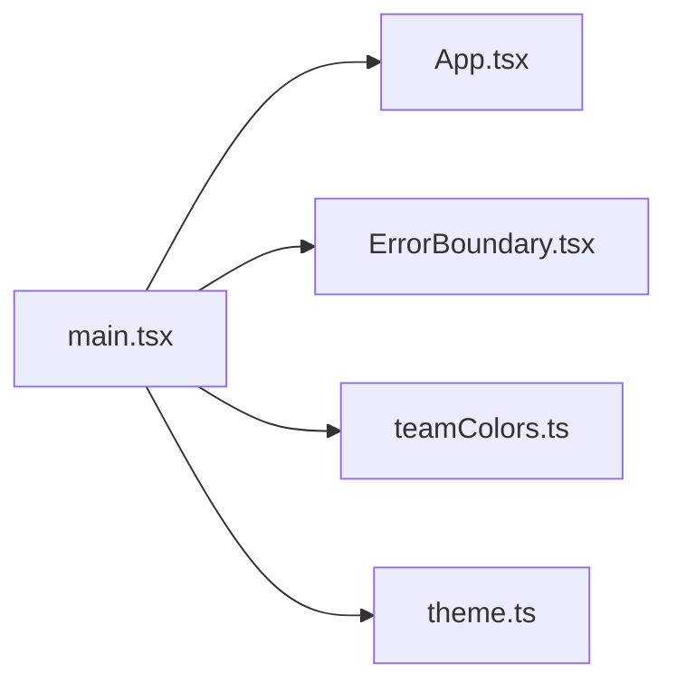

# main.tsx

저장소 경로 `frontend/src/main.tsx` 의 관계 노트입니다. `scripts/codegraph.py` 가 생성하므로 직접 수정하지 않습니다.

## imports

- [[graph/frontend/src/App|App.tsx]]
- [[graph/frontend/src/components/ErrorBoundary|ErrorBoundary.tsx]]
- [[graph/frontend/src/lib/teamColors|teamColors.ts]]
- [[graph/frontend/src/lib/theme|theme.ts]]

## imported by

- 없음
