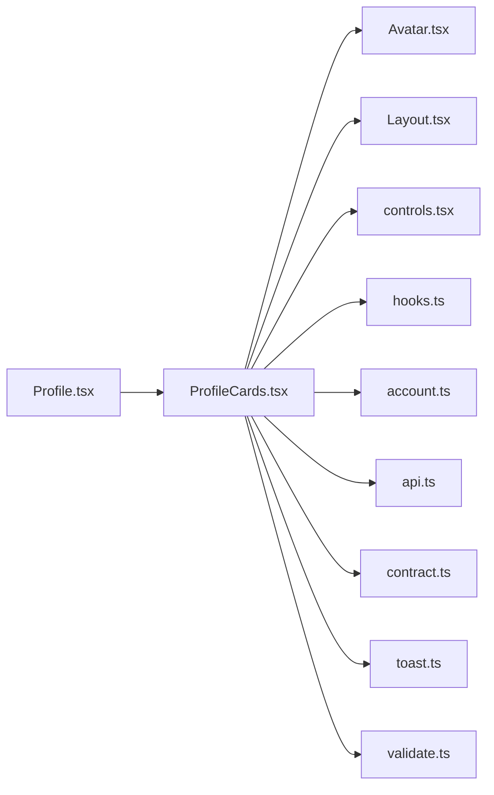

# ProfileCards.tsx

저장소 경로 `frontend/src/routes/ProfileCards.tsx` 의 관계 노트입니다. `scripts/codegraph.py` 가 생성하므로 직접 수정하지 않습니다.

## imports

- [[graph/frontend/src/components/Avatar|Avatar.tsx]]
- [[graph/frontend/src/components/Layout|Layout.tsx]]
- [[graph/frontend/src/components/controls|controls.tsx]]
- [[graph/frontend/src/components/hooks|hooks.ts]]
- [[graph/frontend/src/lib/account|account.ts]]
- [[graph/frontend/src/lib/api|api.ts]]
- [[graph/frontend/src/lib/contract|contract.ts]]
- [[graph/frontend/src/lib/toast|toast.ts]]
- [[graph/frontend/src/lib/validate|validate.ts]]

## imported by

- [[graph/frontend/src/routes/Profile|Profile.tsx]]
