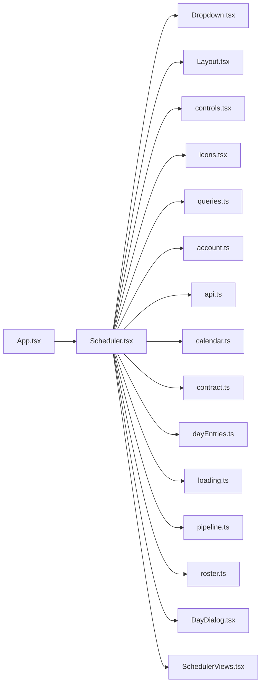

# Scheduler.tsx

저장소 경로 `frontend/src/routes/Scheduler.tsx` 의 관계 노트입니다. `scripts/codegraph.py` 가 생성하므로 직접 수정하지 않습니다.

## imports

- [[graph/frontend/src/components/Dropdown|Dropdown.tsx]]
- [[graph/frontend/src/components/Layout|Layout.tsx]]
- [[graph/frontend/src/components/controls|controls.tsx]]
- [[graph/frontend/src/components/icons|icons.tsx]]
- [[graph/frontend/src/components/queries|queries.ts]]
- [[graph/frontend/src/lib/account|account.ts]]
- [[graph/frontend/src/lib/api|api.ts]]
- [[graph/frontend/src/lib/calendar|calendar.ts]]
- [[graph/frontend/src/lib/contract|contract.ts]]
- [[graph/frontend/src/lib/dayEntries|dayEntries.ts]]
- [[graph/frontend/src/lib/loading|loading.ts]]
- [[graph/frontend/src/lib/pipeline|pipeline.ts]]
- [[graph/frontend/src/lib/roster|roster.ts]]
- [[graph/frontend/src/routes/DayDialog|DayDialog.tsx]]
- [[graph/frontend/src/routes/SchedulerViews|SchedulerViews.tsx]]

## imported by

- [[graph/frontend/src/App|App.tsx]]
